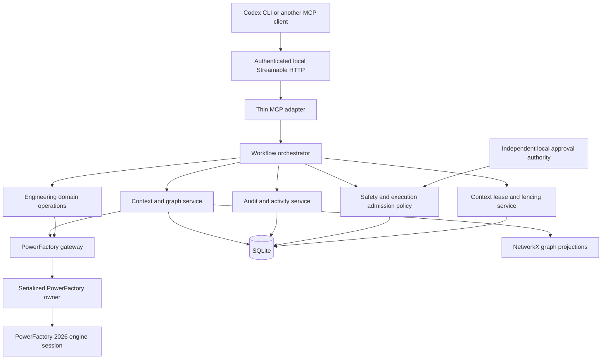
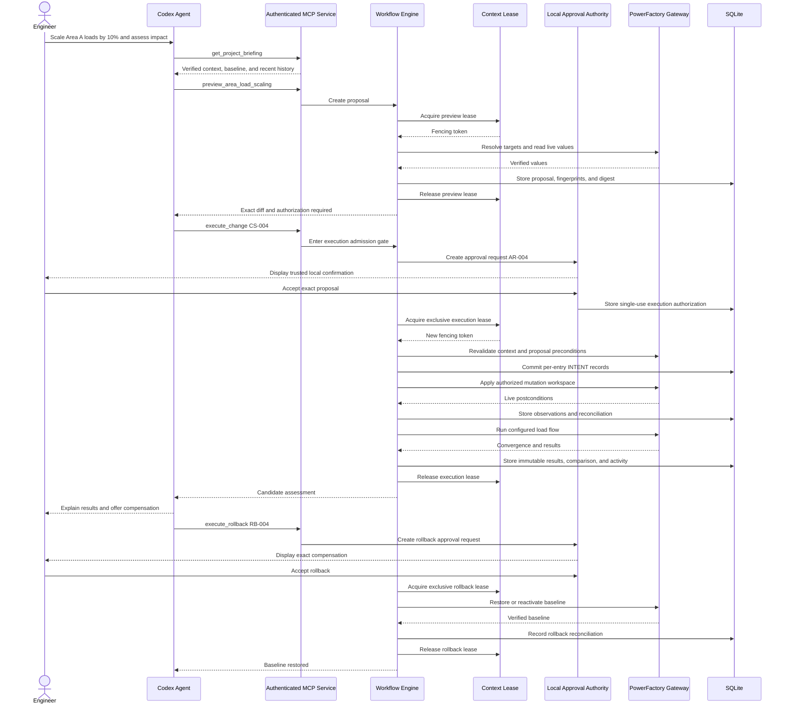

# PowerFactory Agent — Full Product Roadmap

## 1. Product Definition

PowerFactory Agent is a local, headless engineering capability layer that allows MCP-compatible AI agents to inspect, modify, simulate, diagnose, and report on DIgSILENT PowerFactory models through high-level power-system workflows.

The product is not a chatbot, a Python code generator, or a thin collection of raw PowerFactory API methods. Its value comes from encoding safe, repeatable engineering operations that an agent can plan and invoke while deterministic application code controls validation, independent human authorization, execution, auditing, and recovery.

The initial client is Codex CLI. The core remains MCP-compatible and model-independent so other agent clients can use the same capabilities without changing the engineering or PowerFactory layers.

### Product category

**Work and Productivity** — professional workflow automation for power-system engineers.

### Headline workflow

The first complete workflow must support this request:

> Inspect the active model, establish a baseline, preview scaling loads in a selected area, show the exact proposed changes for independent human authorization, execute the authorized changes, run a load flow, identify new voltage or thermal violations, compare the candidate with the baseline, and offer an independently authorized rollback.

This workflow is not a temporary demonstration. It is the first vertical capability of the final product and establishes the patterns used by every later engineering operation.

---

## 2. Product Principles

### 2.1 Engineering tools are the product

MCP is the transport protocol. Codex CLI is the first client. GPT provides planning and reasoning. The durable product value is the engineering capability layer between the agent and PowerFactory.

### 2.2 The model proposes; deterministic code governs

The agent may choose an operation and interpret its result, but it does not decide whether an unsafe write is technically permissible. The workflow layer enforces:

```text
inspect → preview → independent human authorization → execute
→ calculate → validate → report → independently authorized rollback
```

### 2.3 Every mutation requires independent human authorization

No model change is applied merely because the agent requested it. A mutation must reference a stored, unexpired preview and pass an execution admission gate backed by an agent-inaccessible local approval authority. The applied operation must match the authorized preview exactly.

Approval is not an ordinary agent-callable MCP tool. MCP elicitation may present a confirmation only when the host can guarantee genuine human interaction; otherwise an OS-native prompt or protected local approval page is used. The server does not treat sequencing, an agent message, or an untrusted elicitation response as authorization.

Every authorization binds the proposal digest, dependency-scoped live-state fingerprint, operation type, authenticated local principal, expiration, mutation strategy, single-use execution ID, and expected workflow version. Any mismatch invalidates it.

Rollback is also an explicit mutation and therefore requires independent authorization during normal operation. Automatic recovery is reserved for restoring consistency after an interrupted or partially completed write.

### 2.4 High-level operations, not unrestricted attributes

The agent-facing API exposes operations such as:

- `preview_area_load_scaling`
- `execute_change`
- `run_validated_load_flow`
- `find_voltage_violations`
- `compare_results`
- `rollback_change`

A generic `set_attribute(object, attribute, value)` tool is not part of the MCP surface. Low-level attribute access remains internal to the PowerFactory gateway and is reachable only through validated domain operations.

### 2.5 Cached context is useful, but live state is authoritative

The system persists model context so new agents and threads do not repeatedly rediscover the same network. Cached topology can answer exploratory questions. Consequential calculations and mutations must verify the relevant project configuration and object values against the live PowerFactory session.

### 2.6 The graph is never the write path

The knowledge graph represents known model facts, configuration, results, and history. It does not directly mutate PowerFactory. Domain operations write through the gateway and update graph projections only after PowerFactory confirms the operation.

### 2.7 Local-first by design

Grid models and study results can be commercially or operationally sensitive. The MCP server, database, graph index, audit history, and PowerFactory engine run on the engineer's machine by default. Remote data transfer is not required by the core product.

### 2.8 One supported environment before broad compatibility

The first supported target is PowerFactory 2026 on Windows with an API-enabled licence. The runtime uses a CPython major/minor version and process architecture for which the installed PowerFactory release and service pack provides a compatible `powerfactory` extension module. Compatibility is detected from the installation and verified with a real import and engine-start probe rather than a hardcoded release-to-Python assumption. Version-specific behavior is isolated in the gateway so additional versions can be added deliberately.

### 2.9 Graph-assisted development

[Graphify](https://github.com/Graphify-Labs/graphify) is a required development tool for indexing the product codebase and helping coding agents navigate symbols, dependencies, architecture boundaries, and change impact. Coding agents should query the Graphify code graph before broad codebase exploration or cross-cutting edits and refresh the index after material structural changes.

Graphify supports Codex directly, as well as Claude Code and other agent platforms. Installing its Python package does not automatically index a repository. The development setup therefore has two levels:

1. install the Graphify executable once in an isolated tool environment;
2. install the correct Graphify skill into each repository and generate a separate `graphify-out/` graph there.

Codex invokes the installed skill with `$graphify`; other hosts use their platform-specific skill invocation. Agents may also navigate an already-generated graph through `GRAPH_REPORT.md`, the wiki, `graph.json`, the Graphify CLI, or its MCP server. Agents must not pretend a graph exists or is current when graph generation has not completed.

The Graphify code graph is development infrastructure. It is distinct from the product's Power-System Knowledge Graph and is never treated as an authoritative source of PowerFactory model facts.

### 2.10 Open-source implementations are active source material

Clone [PowerMCP](https://github.com/Power-Agent/PowerMCP) and [`powerfactory-tools`](https://github.com/ieeh-tu-dresden/powerfactory-tools) into the development workspace and inspect them for proven implementation patterns, edge cases, and reusable code. The project should not waste time rediscovering solved connection, lifecycle, serialization, version-handling, study-case, unit, and export problems.

Every adopted pattern or copied implementation must record its source repository, commit SHA, licence, original file, local destination, changes made, and validation evidence. Selective reuse is encouraged when licensing and architecture permit it; unsafe product boundaries are not inherited merely because their underlying code is useful.

---

## 3. System Architecture



### Layer responsibilities

#### MCP transport and adapter

- Runs as a long-lived local Streamable HTTP service bound to `127.0.0.1`.
- Requires a generated bearer credential or equivalent local authorization; localhost binding alone is not trusted.
- Validates HTTP `Origin` where applicable and enforces request and payload limits.
- Defines typed MCP tools and resources from versioned machine-readable schemas.
- Validates transport-level inputs and converts domain results into bounded, serializable responses.
- Contains no PowerFactory object discovery or engineering calculations.
- Remains replaceable by another client adapter.

#### Workflow orchestrator

- Coordinates multi-step engineering workflows.
- Maintains workflow state, operation state, calculation state, rollback state, and workspace-cleanup state without conflating them.
- Enforces ordering between preview, independent authorization, execution, simulation, validation, and rollback.
- Uses idempotency keys and compare-and-swap checks on durable workflow versions.
- Records each state transition before returning control to the agent.

#### Safety, lease, and approval policy

- Confirms that a preview exists and remains fresh.
- Acquires an exclusive context lease with a monotonically increasing fencing token for live PowerFactory access.
- Releases the lease while a proposal awaits human authorization, then reacquires and revalidates it before execution.
- Confirms that authorization applies to the exact preview digest, live-state fingerprint, operation, principal, execution ID, and workflow version.
- Rejects writes against stale configuration, changed target values, expired leases, or reused authorizations.
- Defines which operations are allowed and what validation each requires.

#### Engineering domain operations

- Expresses PowerFactory work in power-system terms.
- Resolves areas, assets, operating limits, and calculation intent.
- Produces typed previews, results, comparisons, and violations.
- Does not know about MCP request formats.

#### Context and graph service

- Builds and persists the power-system knowledge graph.
- Tracks configuration keys, live-state fingerprints, extraction revisions, workspace revisions, and calculation-input digests separately.
- Serves configured-size-limited subgraphs and model summaries.
- Adds timestamped calculation and change overlays.
- Verifies freshness before live-sensitive operations.

#### Audit and activity service

- Maintains an append-only record of agent requests, tool invocations, approval requests, execution authorizations, mutations, calculations, violations, and recoveries.
- Produces concise cross-thread project briefings.
- Projects event relationships into an activity graph.
- Stores observed actions and results, not hidden model reasoning.

#### PowerFactory gateway

- Is the only layer allowed to import and call the official `powerfactory` module.
- Converts stable domain identifiers into live PowerFactory objects.
- Encapsulates PowerFactory version details, object classes, attributes, activation, and calculation commands.
- Never returns raw PowerFactory object handles beyond the worker boundary.

#### Serialized PowerFactory owner

- Owns the application handle and engine lifecycle.
- Executes all PowerFactory API calls on one dedicated thread during the initial proof.
- Prevents concurrent access to a non-thread-safe application session.
- Treats client timeout as loss of interest, not cancellation of an in-flight native call.
- Keeps the worker occupied until the real PowerFactory call returns and quarantines an unresponsive engine.
- Evolves to a dedicated worker process over IPC if thread-level isolation cannot recover reliably from blocked native calls.

---

## 4. Runtime and State Model

### 4.1 PowerFactory runtime hierarchy

```text
One authenticated local MCP HTTP service
└── One serialized PowerFactory owner
    └── One dedicated engine-mode application session
        └── One active project
            ├── One active study case
            ├── Zero or one active operational scenario
            ├── Zero or more active grid variants/stages
            └── One or more active grids
```

The local service, not an MCP client, owns the persistent PowerFactory session. A launcher acquires an atomic OS-level singleton lock scoped to the PowerFactory installation and user profile. Process-discovery metadata is diagnostic only; stale owners are validated through PID and authenticated health checks. Subsequent clients connect to the existing service instead of launching another engine.

Initially, one workflow at a time may hold the live context lease. Other clients may read immutable snapshots or cached results but cannot activate another configuration or perform live reads that could disturb the operation envelope.

### 4.2 Configuration, state, and revision identities

Do not collapse PowerFactory configuration, live model state, cache state, mutation state, and workflow state into one graph revision.

| Identity | Meaning |
|---|---|
| `configuration_key` | PowerFactory installation/profile plus selected project, study case, scenario, variants/stages, and active grids |
| `live_state_fingerprint` | Dependency-scoped fingerprint of live inputs relevant to an operation |
| `extraction_revision` | Monotonic revision of persisted model context; a new revision may reflect only a cache rebuild |
| `workspace_revision` | Revision of the selected mutation workspace |
| `calculation_input_digest` | Exact relevant model state, calculation settings, and engineering-policy version used for a run |
| `workflow_version` | Compare-and-swap version of durable workflow state |

The system does not hash the entire PowerFactory model before every operation. A load-scaling preview fingerprints selected loads and relevant configuration. A load-flow calculation digest includes every input the implementation can reliably identify. Broader untracked changes conservatively invalidate dependent previews, authorizations, baselines, and results.

Invalidation rules are explicit:

- a relevant `live_state_fingerprint` change invalidates pending proposals, execution authorizations, trusted baselines, and dependent classifications;
- a `workspace_revision` change invalidates pending proposals and authorizations for that workspace;
- an `extraction_revision` change invalidates extraction-bound cursors and projections but does not by itself prove the live model changed;
- a `calculation_input_digest` permanently binds a result to the exact known state, calculation settings, and policy version;
- a `workflow_version` mismatch rejects a command through compare-and-swap rather than silently replaying it.

### 4.3 Stable identifiers

PowerFactory object handles are process-local and unsuitable for persistence or MCP responses. The identifier specification separates:

1. **Product identity:** an opaque internal UUID used by SQLite, workflows, and MCP.
2. **PowerFactory locator:** versioned evidence used to resolve that identity to a live object.

Resolution prefers a reliable native persistent PowerFactory identifier when available. Class plus canonical object path is only a fallback locator and is not treated as stable across renames or moves. The gateway verifies project provenance, class, and runtime identity before use.

The specification and integration suite must cover duplicate names, renames, moves, project copies, deletion, deletion followed by same-name recreation, class mismatch, and stale locators. Deletion and recreation normally produces a new product identity. If PowerFactory cannot provide enough persistent evidence, the limitation is reported rather than hidden.

### 4.4 Freshness levels

```text
CACHED
  Persisted data from a previous extraction. Suitable for discovery.

VERIFIED
  Context identity and relevant object fingerprints were checked against the current session.

LIVE
  Values were read from PowerFactory as part of the current operation.
```

Mutation previews require verified configuration and live target values. Executing a proposal requires reacquiring the context lease and rechecking its configuration key, dependency-scoped live-state fingerprint, workspace revision, target values, authorization, and workflow version immediately before writing.

---

## 5. Persistent Knowledge Model

The product maintains two related graphs backed by normalized SQLite records and projected into NetworkX for traversal.

### 5.1 Power-system knowledge graph

#### Structural nodes

- `Project`
- `StudyCase`
- `OperationalScenario`
- `GridVariant`
- `GridStage`
- `Grid`
- `Area`
- `Zone`
- `Substation`
- `Bus`
- `Terminal`
- `Cubicle`
- `Line`
- `Transformer`
- `Switch`
- `Load`
- `Generator`
- `PVSystem`
- `Shunt`
- `ExternalGrid`

#### Runtime and analytical nodes

- `ModelContext`
- `CalculationRun`
- `ResultSnapshot`
- `Violation`
- `ChangeSet`
- `ApprovalRequest`
- `ExecutionAuthorization`
- `Rollback`

#### Principal relationships

- `CONTAINS`
- `CONNECTS_TO`
- `TERMINATES_AT`
- `BELONGS_TO_AREA`
- `BELONGS_TO_ZONE`
- `ACTIVE_IN`
- `USES_SCENARIO`
- `USES_VARIANT`
- `HAS_RESULT`
- `HAS_VIOLATION`
- `AFFECTED_BY`
- `DERIVED_FROM`

#### Fact provenance

Every node attribute and relationship records provenance:

```text
EXTRACTED
  Read directly from the PowerFactory API.

DERIVED
  Computed deterministically from extracted topology or results.

INFERRED
  Suggested by an agent or heuristic and never treated as an authoritative model fact.
```

An inferred relationship cannot authorize a mutation without live verification.

### 5.2 Project activity graph

The activity model allows a new agent thread to understand what happened without replaying prior conversations.

Example:

```text
ChangeSet CS-004
    → AUTHORIZED_BY → ExecutionAuthorization EA-004
    → APPLIED_IN → CalculationRun LF-009
    → PRODUCED → Violation V-021
    → REVERSED_BY → Rollback RB-004
```

The append-only event log is the source of truth. The graph is a query projection rebuilt from those events when necessary.

A cross-thread briefing should answer:

- What model and configuration are active?
- When was context last verified?
- What baseline is currently trusted?
- What changes were proposed, authorized, executed, rejected, or rolled back?
- What calculations ran and what did they find?
- Is any workflow incomplete or awaiting human authorization?
- Did an interrupted write leave recovery work?

### 5.3 Why SQLite and NetworkX

SQLite provides durable transactions, constraints, indexed lookup, and simple local deployment. NetworkX provides in-memory traversal, shortest paths, neighborhoods, connected components, and bounded subgraph extraction.

Neo4j or another graph server is intentionally excluded until graph size or query concurrency proves the local approach insufficient.

---

## 6. Core Domain Contracts

Define these contracts before exposing MCP tools. Names may evolve, but their responsibilities must remain distinct.

### `ModelContext`

Captures the `configuration_key`, PowerFactory version, product identities and live locators, `extraction_revision`, extraction timestamp, freshness, and dependency-scoped fingerprints. It does not use one graph revision as a substitute for live model state.

### `AssetReference`

A serializable, project-scoped reference to a PowerFactory asset. It contains identity and display metadata but never a live object handle.

### `ChangePreview`

Contains:

- requested engineering operation;
- resolved target assets;
- before and proposed values with units;
- selection criteria;
- warnings and exclusions;
- `configuration_key`;
- dependency-scoped `live_state_fingerprint`;
- `extraction_revision` and `workspace_revision`;
- expected `workflow_version`;
- operation specification and engineering-policy versions;
- expiry time;
- deterministic content digest;
- required validation steps.

### `ApprovalRequest` and `ExecutionAuthorization`

`ApprovalRequest` records the exact proposal awaiting review. `ExecutionAuthorization` is created only by the independent local approval authority and records the authenticated principal, proposal digest, configuration key, live-state fingerprint, operation type, mutation strategy, expected workflow version, expiration, and single-use execution ID. Agent identity and client identity are audit metadata, not authorization authority.

### `AppliedChange`

Records the values PowerFactory confirmed after application, the mutation strategy, affected assets, timestamps, and verification status.

### `LoadFlowRun`

Contains the configuration key, calculation-input digest, exact command settings, engineering-policy version, convergence state, diagnostic messages, result snapshot ID, duration, and references to logs.

### `Violation`

Contains asset identity, violation type, measured value, limit, unit, severity, source calculation, and whether it is new, resolved, or unchanged relative to a baseline.

### `ResultComparison`

Compares two calculation runs and reports convergence changes, voltage deltas, loading deltas, added/removed violations, and changes selected by a named, versioned materiality policy.

### `RollbackPlan`

Previews how an applied change will be reversed, including conflicts, candidate workspace disposition, values to restore, and validation to rerun.

### `RollbackResult`

Records restored state, conflicts, verification evidence, and whether the baseline calculation was reproduced within configured tolerances.

---

## 7. Mutation and Rollback Strategies

Both strategies implement one common interface and are evaluated independently. They are complementary rather than mutually exclusive because the change ledger remains valuable under scenario isolation.

```python
class MutationWorkspace(Protocol):
    def preview(self, operation: Operation) -> ChangePreview: ...
    def execute(self, execution_id: str) -> AppliedChange: ...
    def preview_rollback(self, applied_change_id: str) -> RollbackPlan: ...
    def execute_rollback(self, execution_id: str) -> RollbackResult: ...
    def verify(self) -> VerificationResult: ...
```

### 7.1 Strategy A — Direct mutation with change ledger

The system stores one entry per object attribute:

```text
object stable ID
attribute key
unit
before value
proposed value
confirmed applied value
current workflow state
```

Before rollback, the gateway compares the live value with the confirmed applied value. If they differ, rollback stops because a human or another process may have made a newer change.

```text
Expected applied value: 22 MW
Current live value:      24 MW
Outcome: conflict; do not overwrite
```

This strategy cannot make SQLite and PowerFactory commit atomically. It therefore uses a write-ahead and reconciliation protocol for every change entry:

1. Validate every target before the first write.
2. Persist and commit an `INTENT` with the expected precondition and postcondition.
3. Write the value through the serialized PowerFactory owner.
4. Read the live postcondition.
5. Persist the observation and mark the entry reconciled.
6. If a later write fails, enter recovery mode.
7. Restore only entries whose current values still match this operation's observed postcondition.
8. Report every unresolved entry prominently.

Recovery classifies each entry as:

```text
BEFORE
  Live state matches the recorded precondition.

AFTER_OBSERVED
  Live state matches the intended postcondition; this does not prove which actor caused it.

DIVERGED
  Live state matches neither expected value.

UNAVAILABLE
  The engine or target object cannot currently be inspected.
```

This guarantees deterministic recovery classification whenever live state is inspectable. `DIVERGED` and `UNAVAILABLE` quarantine the affected workflow for manual review.

### 7.2 Strategy B — Study case and operational scenario isolation

The system creates a candidate configuration inside the same project and engine session:

```text
Original project
├── Baseline study case
│   └── Baseline operational scenario
└── Candidate study case
    └── Candidate operational scenario
```

For operating-value changes such as load scaling, the candidate operational scenario should isolate values. Grid variants or stages are used for supported structural changes. Copying a study case alone is not assumed to duplicate underlying network data.

This strategy requires an empirical capability test for each supported attribute category. The test must prove that candidate changes do not alter baseline values after switching configurations.

Rollback normally means reactivating and verifying the baseline configuration, followed by optional candidate cleanup. The ledger still records exact before and after values.

### 7.3 Experimental branches

Use short-lived experiment branches:

```text
experiment/direct-ledger
experiment/scenario-isolation
```

Both branches must run the same mutation contract tests. After the experiments, merge the proven implementation behind the shared interface rather than maintaining divergent product branches.

### 7.4 Selection policy

The product chooses the safest proven strategy for each operation:

- scenario isolation when the relevant attributes are demonstrably scenario-specific;
- variant isolation for explicitly supported topology/configuration changes;
- direct ledger mutation only for operations with tested restoration behavior;
- project cloning only as a future high-isolation mode when native configuration isolation is insufficient.

---

## 8. Proposed Repository Structure

```text
powerfactory-agent/
├── pyproject.toml
├── specs/
│   ├── architecture/
│   │   ├── deployment-and-process-ownership.md
│   │   ├── approval-authority.md
│   │   ├── context-and-lease-model.md
│   │   └── identity-and-revisions.md
│   ├── workflows/
│   │   ├── workflow-state-machine.md
│   │   └── crash-reconciliation-matrix.md
│   ├── engineering/
│   │   ├── area-load-scaling-v1.md
│   │   └── load-flow-and-violation-policy-v1.md
│   ├── schemas/
│   │   ├── domain/
│   │   └── mcp/
│   ├── delivery/
│   │   └── buildout-dependency-matrix.md
│   └── development/
│       ├── agent-code-navigation.md
│       └── open-source-adoption-ledger.md
├── src/
│   └── powerfactory_agent/
│       ├── config/
│       │   ├── models.py
│       │   └── settings.py
│       ├── domain/
│       │   ├── assets.py
│       │   ├── calculations.py
│       │   ├── changes.py
│       │   ├── context.py
│       │   ├── results.py
│       │   └── violations.py
│       ├── gateway/
│       │   ├── protocol.py
│       │   ├── powerfactory_2026.py
│       │   ├── identifiers.py
│       │   ├── worker.py
│       │   ├── leases.py
│       │   └── lifecycle.py
│       ├── graph/
│       │   ├── builder.py
│       │   ├── schema.py
│       │   ├── queries.py
│       │   ├── freshness.py
│       │   └── projections.py
│       ├── persistence/
│       │   ├── database.py
│       │   ├── migrations.py
│       │   └── repositories.py
│       ├── operations/
│       │   ├── inventory.py
│       │   ├── loadflow.py
│       │   ├── load_scaling.py
│       │   ├── diagnostics.py
│       │   ├── comparison.py
│       │   └── reporting.py
│       ├── safety/
│       │   ├── approval_authority.py
│       │   ├── admission.py
│       │   ├── policies.py
│       │   ├── direct_ledger.py
│       │   ├── scenario_workspace.py
│       │   └── recovery.py
│       ├── workflows/
│       │   ├── engine.py
│       │   ├── states.py
│       │   └── area_load_study.py
│       ├── history/
│       │   ├── events.py
│       │   ├── activity_graph.py
│       │   └── briefing.py
│       └── mcp/
│           ├── server.py
│           ├── transport.py
│           ├── authentication.py
│           ├── tools.py
│           ├── resources.py
│           └── serialization.py
└── tests/
    ├── unit/
    ├── contract/
    ├── integration/
    ├── recovery/
    └── fixtures/
```

Use `uv` for environment and dependency management. The repository pins a CPython major/minor and architecture proven compatible with the installed PowerFactory 2026 extension module and service pack.

### Companion specification gate

The roadmap defines sequence and intent. Coding agents must not infer executable behavior from roadmap prose where a companion specification is required. Before implementing the affected buildout, create and accept:

1. deployment/process-ownership and approval-authority ADRs;
2. context-lease, fencing, identity, and revision specifications;
3. a formal workflow transition table and crash-reconciliation matrix;
4. versioned area-load-scaling and load-flow/violation-policy contracts;
5. machine-readable domain and MCP request/response schemas;
6. a buildout dependency matrix;
7. a Graphify indexing/navigation procedure and an open-source adoption ledger.

The dependency matrix records prerequisites, required specifications, implementation outputs, executable completion commands, real-PowerFactory tests, decision gates, evidence, and rollback or fallback decisions. A buildout is not complete because code exists; its specified commands and decision gate must pass.

### Development bootstrap gate

#### One-time Graphify installation

Graphify requires Python 3.10 or newer. Install the verified version in an isolated `uv` tool environment, not in the PowerFactory runtime environment:

```bash
uv tool install --python 3.12 "graphifyy==0.9.15"
uv tool update-shell
graphify --version
```

The verified version for this roadmap is `0.9.15`. The base package is sufficient for code navigation; install optional extras only when their capability is deliberately needed. Upgrade Graphify only through an explicit dependency update and rerun the installation checks. The PyPI distribution is named `graphifyy`; the executable and skill command are named `graphify`. Keeping it in a `uv` tool environment prevents Graphify dependencies from changing the CPython environment required by `powerfactory.pyd`.

#### Clone and initialize every repository

Clone the upstream repositories as siblings of the product repository rather than nested Git repositories:

```text
workspace/
├── powerfactory-agent/
├── PowerMCP/
└── powerfactory-tools/
```

For each of those three repositories:

1. enter the repository root;
2. run `graphify install --project --platform codex` so the Codex-specific skill is stored in the repository;
3. run `graphify install --project --platform agents` so spec-compatible agents such as Zed can discover the project skill;
4. ensure Codex has `multi_agent = true` under `[features]` in `~/.codex/config.toml` for parallel extraction;
5. open Codex in that repository and run `$graphify . --wiki`;
6. verify that `graphify-out/graph.json`, `graphify-out/GRAPH_REPORT.md`, and `graphify-out/wiki/index.md` exist;
7. run `graphify codex install` after graph generation to add the persistent graph-first guidance to the repository's `AGENTS.md` and Codex integration;
8. keep each repository's graph separate so upstream and product symbols cannot be confused.

Installing the package is not enough: the repository is considered Graphify-enabled only after its own graph artifacts have been generated successfully.

#### Coding-agent bootstrap contract

When an agent receives a fresh checkout or clone, it must perform this sequence before broad source analysis:

1. run `graphify --version`;
2. if the command is unavailable, install the pinned package with the one-time `uv tool install` command above;
3. verify that the current repository contains the Codex or generic project-scoped Graphify skill;
4. check for `graphify-out/graph.json` and `graphify-out/GRAPH_REPORT.md`;
5. if they are absent, invoke `$graphify . --wiki` in Codex, or the equivalent Graphify skill command in the active host;
6. once generated, prefer scoped `graphify query`, `graphify path`, or `graphify explain` calls before reading the full report or broadly grepping source;
7. verify graph-derived conclusions against the cited source locations before editing;
8. after material changes, run `$graphify . --update` in Codex, or the equivalent host command, and report whether the graph is current.

For upstream clones, Graphify outputs and local agent instructions are development artifacts. Do not commit them back to the upstream repository unless an explicit contribution requires it; verify `git status` after initialization.

#### Keep graphs current

After material changes, run `$graphify . --update` from Codex or the equivalent command in the active host. Install Graphify's repository hook so committed code changes rebuild the local AST graph automatically:

```bash
graphify hook install
graphify hook status
```

During active multi-agent development, `graphify watch .` may be run from the repository root. Code changes are parsed locally through tree-sitter. Documentation, PDF, image, and other semantic content may use the active assistant's model or a configured backend. Agents must report stale or missing graph output instead of relying on it silently.

#### Agent access modes

Codex uses its project-scoped Graphify skill directly. Zed and other spec-compatible agents use the project-scoped generic agent skill. For clients that prefer repeated structured tool calls, Graphify's stdio or authenticated HTTP MCP server may be configured against the repository's `graphify-out/graph.json`.

Use distinct graph or MCP names such as `graphify-product`, `graphify-powermcp`, and `graphify-powerfactory-tools`. Agents must verify important graph findings against source files before editing because Graphify edges may be `EXTRACTED`, `INFERRED`, or `AMBIGUOUS`.

#### Source, privacy, and adoption controls

1. Pin and record the inspected commit SHA and licence for each upstream clone.
2. Review Graphify's data path before indexing confidential code: code AST extraction is local, while semantic extraction for documents and media may use Codex, another active assistant, or a configured model backend and consume model tokens.
3. Exclude credentials, licences, confidential PowerFactory models, generated results, databases, and other sensitive artifacts from the indexed corpus.
4. Require coding agents to consult the product code graph before cross-cutting changes and the reference graphs before reimplementing equivalent PowerFactory or MCP behavior.
5. Record each adopted pattern or code extraction in `open-source-adoption-ledger.md` before merging it.
6. Preserve attribution and licence notices required by the upstream project.
7. Validate adapted code through this product's contracts and safety requirements; upstream behavior alone is not acceptance evidence.

The development gate passes when agents can navigate the product and both reference repositories through separate Graphify graphs, all inspected revisions and licences are recorded, graph freshness is visible, and provenance rules are executable rather than informal.

---

## 9. Sequential Product Buildouts

Each buildout depends on the stable outputs of the previous buildouts. A buildout is complete only when its success criteria and dependency-matrix commands pass; adding more tools does not compensate for an unreliable lower layer.

## Buildout 0 — Environment and API Capability Proof

### Goal

Prove that the selected Windows environment, licence, Python interpreter, and PowerFactory 2026 installation can support the product lifecycle.

### Implementation

1. Record the exact PowerFactory release, service pack, installation path, licence type, `powerfactory.pyd` location, extension ABI tag when available, supported CPython major/minor versions, and process architecture.
2. Create the `uv` project with a CPython major/minor and architecture for which that installation ships a compatible extension module.
3. Import `powerfactory` from an external Python process and treat the import probe as authoritative compatibility evidence.
4. Call `GetApplicationExt()` and confirm an application handle is returned.
5. Activate a non-confidential project and study case.
6. List a bounded sample of loads and terminals.
7. Execute `ComLdf` and read at least one voltage and loading result.
8. Shut down cleanly.
9. Repeat the lifecycle to detect stale process, licence, or cleanup problems.
10. Capture API capabilities needed for study cases, scenarios, variants, object identity, logs, and result extraction.
11. Inspect native identity fields and test candidate locators against duplicate names, rename, move, project copy, deletion, and same-name recreation.
12. Record evidence in the buildout dependency matrix rather than hardcoding a PowerFactory-to-Python mapping.

### Deliverable

A deterministic connectivity and lifecycle probe whose output clearly distinguishes installation, licence, import, activation, calculation, and cleanup failures.

### Success criteria

- The probe succeeds repeatedly without manual GUI interaction.
- One failed run does not poison the next run.
- The supported PowerFactory release/service-pack, CPython ABI, process architecture, and extension-module path are explicit.
- Required API methods and identity fields are verified against the actual installation rather than assumed from documentation.

---

## Buildout 1 — Typed Core and Fake Gateway

### Goal

Design the product around engineering contracts before coupling it to PowerFactory implementation details.

### Implementation

1. Define typed domain models for context, assets, previews, approval requests, execution authorizations, operations, changes, calculations, violations, comparisons, and rollbacks.
2. Generate versioned JSON schemas from those models and define compatibility rules.
3. Define `PowerFactoryGateway` as a protocol containing only capabilities required by domain operations.
4. Build an in-memory fake gateway with a small connected network, loads, areas, and deterministic load-flow outputs.
5. Define unit and quantity handling. Do not pass ambiguous bare numbers across boundaries.
6. Define structured error categories:
   - connection failure;
   - configuration mismatch;
   - object not found or ambiguous;
   - stale context;
   - invalid operation;
   - authorization failure;
   - calculation non-convergence;
   - partial mutation;
   - rollback conflict;
   - authorization required or invalid;
   - lease lost;
   - operation still in flight;
   - reconciliation required.
7. Establish JSON serialization that cannot leak Python or PowerFactory object handles.
8. Define named configuration defaults for freshness, pagination, payload size, materiality, and time limits; do not leave subjective terms such as “bounded” or “fresh” undefined.

### Deliverable

A PowerFactory-independent domain package and fake gateway capable of executing the headline workflow in tests.

### Success criteria

- Domain tests run on any development machine without PowerFactory.
- Every public response is serializable and unit-explicit.
- The workflow layer depends on the gateway protocol, not the official API module.

---

## Buildout 2 — PowerFactory Engine Gateway

### Goal

Create a reliable, version-isolated bridge to the official PowerFactory API.

### Implementation

1. Implement engine startup, PowerFactory profile selection, and shutdown.
2. Implement an atomic OS-level singleton lock scoped to the PowerFactory installation and user profile, with user-only process metadata and authenticated health checks.
3. Create a dedicated worker with a single execution thread for the initial proof and document the decision gate for moving it into a separate process over IPC.
4. Route every API call, including reads, through that owner.
5. Define queue deadline, client response deadline, and engine health threshold separately.
6. Persist operation states including `QUEUED`, `CANCELLED_BEFORE_START`, `IN_FLIGHT`, `CLIENT_TIMED_OUT`, `COMPLETED_AFTER_CLIENT_TIMEOUT`, `FAILED`, `ENGINE_UNRESPONSIVE`, and `RECONCILIATION_REQUIRED`.
7. Treat client timeout as non-cancelling once a native call is in flight; return a durable operation ID for later status polling.
8. Quarantine an unresponsive engine and admit no new live workflows until reconciliation.
9. Implement project and study-case activation with post-activation verification.
10. Implement product UUIDs, versioned PowerFactory locators, and live identity resolution.
11. Implement configured-size-limited object queries for initial supported classes.
12. Implement PowerFactory log and command-result extraction.
13. Sanitize API return values into domain primitives before leaving the worker.
14. Make lifecycle operations idempotent where possible.

### Deliverable

`PowerFactoryGateway2026`, satisfying the same contract as the fake gateway.

### Success criteria

- Gateway contract tests pass against the real fixture.
- Parallel client requests cannot execute PowerFactory calls concurrently.
- Duplicate launchers connect to the authenticated existing service instead of starting another engine.
- Client timeout cannot cause the same operation to be resubmitted or executed twice.
- Restart and shutdown do not leave an unusable engine process.
- No public layer imports `powerfactory` outside the gateway package.

---

## Buildout 3 — Read-Only Model Inventory

### Goal

Let an agent understand what model is active without repeatedly issuing broad PowerFactory searches.

### Implementation

1. Extract active project, study case, scenario, variants/stages, grids, areas, and zones.
2. Extract supported network assets and their relevant electrical metadata.
3. Extract terminal and connectivity information needed to reconstruct topology.
4. Normalize units at the gateway boundary while preserving source values and units for audit.
5. Map opaque product UUIDs to live PowerFactory locators and test duplicate names, rename, move, project copy, deletion/recreation, and class mismatch.
6. Produce a configured-size-limited `ModelSummary` rather than returning the entire network to the agent.
7. Record extraction warnings and identity limitations for unsupported or unresolved objects.

### Deliverable

Read-only operations for active context, model summary, component listing, asset lookup, and bounded inventory filters.

### Success criteria

- Repeated extraction preserves product identities when the verified native identity evidence supports it.
- Identity limitations and ambiguous locator cases fail closed rather than fabricating stability.
- The summary accurately counts supported asset categories.
- Unsupported elements are reported rather than silently omitted.
- Large inventories are paginated or filtered before serialization.

---

## Buildout 4 — Persistent Power-System Knowledge Graph

### Goal

Persist structural context and provide graph-native engineering queries across agent threads.

### Implementation

1. Create SQLite migrations for contexts, assets, attributes, relationships, extraction runs, and provenance.
2. Build the typed NetworkX projection from persisted records.
3. Represent parallel equipment without collapsing distinct branches.
4. Model switches and out-of-service elements explicitly.
5. Decide and document the representation of two- and three-winding transformers.
6. Add `extraction_revision` and extraction fingerprints without treating them as live model-state identity.
7. Implement full refresh first, then incremental refresh for known changed assets.
8. Implement bounded queries:
   - neighborhood by hop count;
   - electrical path;
   - assets in area or zone;
   - connected components/islands;
   - assets affected by an outage or change;
   - topology comparison between revisions.
9. Distinguish extracted, derived, and inferred data.
10. Enforce response size limits and return summaries plus stable references.

### Deliverable

A persistent model context that can be restored after MCP or Codex restarts without querying the entire model again.

### Success criteria

- Restarting the server restores the latest extraction revision.
- A context mismatch is detected when the active PowerFactory configuration changes.
- Bounded graph queries avoid sending the complete network to the agent.
- The graph can be rebuilt entirely from SQLite records.

---

## Buildout 5 — Calculation and Result Overlays

### Goal

Run load flows as first-class, reproducible domain operations and attach results to the correct model context.

### Implementation

1. Accept `load-flow-and-violation-policy/v1` before implementing classification.
2. Represent load-flow settings explicitly rather than relying on hidden active-command defaults.
3. Define trusted-baseline criteria: verified configuration, converged calculation, exact command settings, policy version, calculation-input digest, complete required result extraction, immutability, and supersession rules.
4. Run a baseline load flow and capture convergence, warnings, logs, and duration.
5. Extract supported bus voltages, branch/transformer loading, and other required metrics.
6. Store immutable result snapshots scoped to configuration key and calculation-input digest.
7. Detect voltage and thermal violations using versioned limits, rating-selection rules, transformer-side rules, numeric tolerances, and units.
8. Classify missing required limits as `NOT_EVALUATED_MISSING_LIMIT`, never implicitly safe.
9. Keep engineering-limit evaluation, comparison materiality, and result equivalence as separate policy concepts.
10. Record provenance and audit for every project-level policy override; weakening a safety limit requires independent authorization.
11. Add result nodes and `HAS_RESULT`/`HAS_VIOLATION` overlays to the graph projection.
12. Prevent live results from being overwritten by a later run; create a new snapshot instead.

### Deliverable

`run_validated_load_flow`, `get_calculation_run`, `find_violations`, and `compare_results` domain operations.

### Success criteria

- Repeating a baseline under unchanged conditions produces equivalent results under the named result-equivalence policy.
- Non-convergence is represented as a structured result, not an unhandled exception.
- Every metric and classification can be traced to its run, calculation-input digest, and engineering-policy version.
- New, resolved, unchanged, and not-evaluated violations are distinguished correctly.

---

## Buildout 6 — Durable Workflow, Authorization, and Audit Foundation

### Goal

Make multi-step work resumable, independently authorized, and auditable across agent threads.

### Implementation

1. Accept the deployment/process-ownership, approval-authority, context-lease, identity/revision, workflow-state-machine, and crash-reconciliation specifications.
2. Add SQLite tables for workflows, operations, operation intents, operation observations, change sets, change entries, approval requests, execution authorizations, context leases, fencing tokens, events, and recovery records.
3. Model workflow state, execution-operation state, calculation state, rollback state, and candidate-workspace cleanup state separately.
4. Define every transition in an executable table with command, legal source states, guards, durable preparation, PowerFactory effect, reconciliation, destination state, retry behavior, and recovery behavior.
5. Require an idempotency key per workflow command and compare-and-swap against `workflow_version`; duplicate commands return the original operation status or result.
6. Acquire a context lease for preview reads, then release it while waiting for human authorization.
7. Reacquire an exclusive lease with a new fencing token before execution and revalidate every proposal precondition.
8. Execute mutation, calculation, and verification as a non-interleavable operation envelope. Other clients may read only immutable snapshots while it runs.
9. On lease expiry, reject new operations from the stale owner but allow an already-started atomic PowerFactory call to finish. Do not restore or release the live context until the call outcome is known or the engine is quarantined and reconciliation is complete.
10. Implement an independent local approval authority and execution admission gate. No agent-callable tool can create an authorization. The authority authenticates the local principal and protects confirmation against replay, cross-site request forgery, and arbitrary local-process assertion.
11. Bind single-use execution authorization to the proposal digest, configuration key, live-state fingerprint, operation type, principal, mutation strategy, expiry, execution ID, and workflow version.
12. Append an audit event before and after every consequential step; audit records never claim success until live verification completes.
13. Persist `INTENT` before every PowerFactory write and reconcile in-flight entries as `BEFORE`, `AFTER_OBSERVED`, `DIVERGED`, or `UNAVAILABLE` on restart.
14. Mark `DIVERGED` and `UNAVAILABLE` workflows as quarantined or manual-review-required rather than guessing.
15. Model rollback as a compensating operation with its own preview, authorization, idempotency key, and reconciliation.
16. Implement the minimum pre-mutation controls: project and operation allowlists, safe-mode startup, restricted local file permissions, redaction, and recovery admission checks.

### Deliverable

A persistent workflow engine that survives process and conversation restarts.

### Success criteria

- An authorized preview cannot be substituted with different values.
- The agent cannot create or forge an execution authorization through the MCP tool surface.
- Restarting while awaiting human authorization preserves the workflow without holding the context lease.
- Restarting after an interrupted write deterministically classifies inspectable entries and quarantines divergent or unavailable state.
- Duplicate or timed-out commands cannot reapply a side effect.
- Audit history reconstructs what was requested, authorized, attempted, observed, reconciled, and compensated.

---

## Buildout 7 — Area Load-Scaling Preview

### Goal

Implement the first high-level mutation operation without applying any changes.

### Implementation

1. Accept the versioned `area-load-scaling/v1` engineering specification.
2. Define the exact supported PowerFactory load classes and whether balanced and unbalanced models are eligible.
3. Define authoritative P/Q attributes, sign conventions, P/Q scaling and power-factor behavior, handling of negative and zero loads, unit normalization, rounding, and percentage/value bounds.
4. Define precedence for controllers, characteristics, profiles, and time-series inputs; exclude unsupported override behavior explicitly.
5. Define area membership using verified PowerFactory relationships, including nested, missing, disconnected, and ambiguous cases.
6. Resolve an area from an unambiguous product identity or verified locator.
7. Select only loads admitted by the specification and the empirical scenario-isolation capability matrix.
8. Report excluded, out-of-service, unsupported, controlled, unavailable, or ambiguous loads.
9. Acquire a context lease and read every target value live.
10. Compute proposed values with unit-aware arithmetic and configured precision.
11. Store one `ChangePreview` and entries for every target attribute, including operation-specification and policy versions.
12. Return a configured-size-limited summary plus snapshot-bound paginated details.
13. Record the configuration key, live-state fingerprint, extraction revision, workspace revision, and workflow version used for selection.
14. Release the lease while the proposal awaits human authorization.

### Deliverable

`preview_area_load_scaling(area, percentage)`.

### Success criteria

- Previewing never changes PowerFactory state.
- The selected asset set is deterministic, specification-compliant, and explainable.
- Unsupported load classes and active overrides are reported rather than approximated.
- P/Q totals, sign handling, rounding, and intended power-factor behavior match `area-load-scaling/v1`.
- Applying any different percentage, target set, policy, configuration, or live-state fingerprint requires a new preview and authorization.

---

## Buildout 8 — Direct-Ledger Mutation Experiment

### Goal

Prove or reject direct mutation with write-ahead intent, live reconciliation, and conflict-aware compensation.

### Implementation

1. Implement `DirectLedgerWorkspace` behind `MutationWorkspace`.
2. Reacquire the exclusive context lease and validate its fencing token before execution.
3. Re-read live values and reject stale proposals before the first write.
4. Persist and commit a per-entry `INTENT` before every PowerFactory write.
5. Apply one authorized change entry at a time, read the live postcondition, and persist the observation.
6. Inject failures before and after the PowerFactory call and before and after observation persistence.
7. Reconcile uncertain entries as `BEFORE`, `AFTER_OBSERVED`, `DIVERGED`, or `UNAVAILABLE`.
8. Preview compensation and detect conflicting newer edits.
9. Restore only conflict-free values after independent rollback authorization.
10. Rerun the baseline calculation and compare results after restoration.

### Deliverable

A measured safety and reliability report from real integration tests, plus the implementation if it meets the contract.

### Success criteria

- Successful execution exactly matches the independently authorized proposal.
- Forced partial failures are classified from live evidence without guessing; divergent or unavailable cases fail closed.
- Conflicting external changes are never overwritten automatically.
- Restored values and baseline results are verified.

---

## Buildout 9 — Scenario-Isolation Mutation Experiment

### Goal

Determine whether native PowerFactory configuration objects provide reliable isolation for supported operating-value changes.

### Implementation

1. Copy the active study case inside the same project and engine session.
2. Copy or create a candidate operational scenario.
3. Associate and activate the candidate configuration.
4. Modify one representative load and switch back to baseline.
5. Verify that baseline values and results remain unchanged.
6. Switch to the candidate and verify that candidate values persist.
7. Repeat for every attribute category required by area load scaling.
8. Test candidate cleanup and interrupted cleanup recovery.
9. Implement `ScenarioWorkspace` only for categories that pass isolation tests.
10. Keep the change ledger active under this strategy.

### Deliverable

A capability matrix identifying which operations are safely isolated by scenario, variant/stage, direct ledger, or neither.

### Success criteria

- Candidate values never leak into the baseline configuration.
- Baseline reactivation is deterministic and verified.
- Candidate artifacts can be identified and cleaned safely.
- Unsupported isolation behavior falls back to an explicitly tested strategy rather than an assumption.

---

## Buildout 10 — Complete Engineering Workflow

### Goal

Compose context, preview, independent authorization, mutation, calculation, comparison, reporting, and rollback into one resumable workflow.

### Implementation

1. Capture or select an immutable trusted baseline that satisfies the versioned engineering-policy contract.
2. Build or verify model context and all distinct revision identities.
3. Acquire a preview lease, read live dependencies, persist the area-load-scaling proposal, and release the lease.
4. Pause durably at `AWAITING_AUTHORIZATION`; no PowerFactory lease remains held.
5. When execution is requested, create an approval request through the independent authority.
6. After human acceptance, reacquire an exclusive context lease with a new fencing token and revalidate the authorization and all proposal preconditions.
7. Apply, calculate, and verify inside a non-interleavable operation envelope.
8. Compare convergence, voltage, loading, and violations with the trusted baseline under the recorded policy version.
9. Produce an engineering summary that separates extracted facts, deterministic derivations, and agent interpretation.
10. Offer rollback with an exact compensating-operation preview.
11. Execute rollback only after independent authorization and verify the restored baseline.
12. Support resuming any waiting or completed-after-client-timeout state from a new client thread.

### Deliverable

The complete headline workflow as an application service independent of MCP.

### Success criteria

- The workflow runs end to end against the real PowerFactory fixture.
- Each state can be resumed after process restart.
- No mutation occurs without a single-use authorization issued by the independent local approval authority.
- The agent-facing tool surface cannot approve its own proposal or rollback.
- Candidate and baseline results are never mixed.
- Rollback reproduces the baseline within defined tolerances or reports why it could not.

---

## Buildout 11 — Thin MCP Surface and Codex Integration

### Goal

Expose the proven application capabilities to Codex CLI and any MCP-compatible client.

### Initial tools

#### Session and context

- `get_session_status`
- `open_project_context`
- `get_model_context`
- `refresh_model_context`
- `get_project_briefing`

#### Graph and inspection

- `query_model_graph`
- `get_asset_context`
- `trace_electrical_path`
- `get_impact_zone`

#### Calculations and results

- `run_validated_load_flow`
- `get_calculation_run`
- `find_violations`
- `compare_results`

#### Proposals and execution

- `preview_area_load_scaling`
- `execute_change`
- `preview_rollback`
- `execute_rollback`
- `get_approval_request_status`
- `get_operation_status`

`execute_change` and `execute_rollback` do not imply authorization. They enter the execution admission gate, which creates or consumes a single-use authorization from the independent local approval authority. No MCP tool can approve a proposal.

#### Workflow and history

- `get_workflow_status`
- `list_pending_approval_requests`
- `get_change_history`
- `get_recent_activity`

### Implementation rules

1. Run a long-lived Streamable HTTP MCP service bound to `127.0.0.1` with generated bearer authentication, applicable `Origin` validation, and user-only credential storage.
2. Generate tool request/response schemas from versioned Pydantic domain contracts.
3. Tool descriptions and MCP annotations state read-only, destructive, idempotent, and side-effect behavior, but annotations are not treated as enforcement.
4. Read tools and execution tools are visibly distinct.
5. Every tool accepts and returns product UUIDs, schema versions, workflow/operation IDs, expected workflow versions, structured error codes, and recovery guidance where applicable.
6. Mutating commands require idempotency keys.
7. Pagination cursors bind query type, extraction or result snapshot revision, filter digest, and expiry.
8. Responses use named payload limits and configured pagination sizes.
9. `query_model_graph` accepts typed query variants such as neighborhood, path, area-assets, impact-zone, and topology-diff; it accepts no arbitrary expression language.
10. MCP cancellation before queue start may cancel work; client timeout after start does not cancel the underlying PowerFactory call.
11. A timed-out call returns or preserves a durable operation ID and must be polled rather than resubmitted.
12. No MCP tool calls the PowerFactory API directly.
13. Agent and client identities are recorded for audit but cannot create execution authorization.
14. Project/operation allowlists, safe-mode recovery checks, local path restrictions, payload limits, and log redaction are active before execution tools are registered.

### Deliverable

A locally configured MCP server usable from Codex CLI without a custom graphical interface.

### Success criteria

- Codex discovers and uses tools without relying on undocumented prompt tricks.
- Switching Codex threads preserves project context and pending workflows.
- A second MCP-compatible client can connect without changes to domain code.
- Attempted unsafe or stale operations return versioned, actionable structured errors.
- Another local process cannot use unauthenticated localhost access to invoke tools.
- A client timeout cannot cause duplicate execution.
- The MCP surface contains no agent-callable approval operation.

---

## Buildout 12 — Activity Graph and Cross-Agent Continuity

### Goal

Give new agent threads accurate, compact context about completed and pending project work.

### Implementation

1. Define append-only activity events for context refreshes, queries, previews, approval requests, execution authorizations, applications, calculations, violations, reports, conflicts, and rollbacks.
2. Create graph projections linking workflows, change sets, authorizations, runs, results, and assets.
3. Generate deterministic project briefings from stored facts.
4. Add queries such as:
   - what changed since an extraction revision or live-state fingerprint;
   - what actions affected an asset;
   - which run introduced a violation;
   - which changes remain applied;
   - which workflows need attention;
   - how the current state differs from the latest trusted baseline.
5. Allow agent-written notes only as explicitly attributed annotations, never as verified engineering facts.
6. Add retention and archival policies without breaking audit relationships.

### Deliverable

Persistent cross-thread continuity based on verified actions rather than conversational memory.

### Success criteria

- A fresh agent thread can accurately summarize current project status from the briefing.
- Every briefing statement links to underlying events or results.
- Rebuilding the activity graph from the event log produces the same relationships.

---

## Buildout 13 — Diagnostics and Failure Explanation

### Goal

Move from reporting calculation failure to gathering evidence and identifying likely causes.

### Implementation

1. Capture PowerFactory command return codes, logs, active configuration, and relevant object states.
2. Detect common deterministic conditions first:
   - no active study case;
   - missing or multiple slack/reference sources;
   - disconnected islands;
   - out-of-service critical equipment;
   - invalid or extreme setpoints;
   - stale calculation command or missing result variables.
3. Use graph traversal to locate affected islands and neighboring equipment.
4. Run bounded diagnostic checks without changing the model.
5. Separate confirmed findings, deterministic deductions, and model-generated hypotheses.
6. Require the normal preview and independent authorization process for any proposed corrective action.
7. Store diagnostic sessions and evidence in activity history.

### Deliverable

`diagnose_load_flow_failure` and structured diagnostic reports.

### Success criteria

- The operation never describes a hypothesis as an extracted fact.
- Every suggested cause includes supporting evidence and confidence/provenance.
- Corrective changes remain separate, previewable operations.

---

## Buildout 14 — Engineering Capability Expansion

### Goal

Expand the operation catalog without weakening safety or introducing raw API exposure.

### Capability order

1. Load and generation setpoint studies.
2. Voltage and thermal violation analysis.
3. Transformer tap adjustment studies.
4. Switch-state and outage studies using proven variant isolation.
5. Contingency analysis and ranking.
6. Short-circuit studies.
7. Generator or renewable interconnection studies.
8. Component creation through typed templates.
9. Time-domain or RMS simulation workflows.
10. Reusable engineering reports and study packages.

### Admission requirements for every new operation

A capability is not agent-facing until it defines:

- engineering inputs and units;
- deterministic target selection;
- supported PowerFactory versions;
- preconditions;
- preview representation;
- independent authorization policy;
- mutation workspace strategy;
- calculation/validation steps;
- rollback or safe disposition;
- audit events;
- unit, contract, integration, and recovery tests.

### Success criteria

The operation catalog grows through repeatable capability templates rather than one-off MCP tools.

---

## Buildout 15 — Reliability, Security, and Operational Hardening

### Goal

Make the local service trustworthy for repeated professional use.

### Implementation

The first-line controls—project/operation allowlists, authenticated localhost transport, independent approval authority, singleton ownership, context leases, safe-mode admission, path restrictions, payload limits, and redaction—are prerequisites of earlier mutating and MCP buildouts. This buildout hardens those controls rather than introducing them for the first time.

1. Add database backup, integrity checks, migration rollback, and corruption recovery.
2. Harden engine health checks, quarantine, and controlled restart behavior.
3. Validate stale-lock and stale-lease recovery without starting concurrent PowerFactory sessions.
4. Evaluate and, if required, move the PowerFactory owner into a dedicated worker process over authenticated IPC.
5. Add disk, immutable-result retention, audit retention, and graph-compaction policies.
6. Add structured logs with correlation IDs across MCP, workflow, lease, approval, gateway, and calculation layers.
7. Add failure injection for service termination, worker termination, client timeout, engine unresponsiveness, database failure, lease expiry, and partial mutation.
8. Harden safe-mode startup when unresolved reconciliation records exist.
9. Require explicit user action before destructive cleanup of study cases, scenarios, variants, or projects.
10. Audit local credential rotation, filesystem permissions, Origin validation, and redaction behavior.

### Success criteria

- The system fails closed when authorization, lease ownership, context, live-state fingerprint, workflow version, or identity cannot be verified.
- Recovery state is visible and actionable after interruption.
- Local-only operation is possible without uploading model content.
- Logs can reconstruct failures without containing unrestricted model dumps.

---

## Buildout 16 — Packaging and Multi-Version Support

### Goal

Make installation reproducible while expanding PowerFactory compatibility deliberately.

### Implementation

1. Detect installed PowerFactory versions, service packs, API directories, `powerfactory.pyd` modules, ABI tags when available, and process architecture.
2. Select only a CPython major/minor and architecture for which the installed release/service pack provides a compatible extension module.
3. Verify compatibility through a real import and `GetApplicationExt()` lifecycle probe before starting the service.
4. Provide clear diagnostics for missing API access, incompatible ABI or architecture, unavailable licence, missing runtime dependencies, and failed engine startup.
5. Package server configuration for Codex CLI and other MCP clients.
6. Separate shared gateway behavior from version-specific implementations.
7. Add a tested compatibility matrix by PowerFactory release, service pack, CPython major/minor ABI, and architecture.
8. Run the gateway contract suite for every claimed combination.
9. Refuse unsupported combinations rather than attempting best-effort execution.

### Success criteria

- A fresh supported machine can install and run the connectivity probe reproducibly.
- Compatibility claims are backed by automated integration results.
- Adding another PowerFactory version does not change domain or MCP contracts unless the engineering capability itself changes.

---

## Buildout 17 — Optional Client Ecosystem

### Goal

Allow different agent experiences without turning the core into a UI-specific application.

### Direction

- Keep MCP as the primary capability protocol.
- Support Codex CLI first.
- Publish configuration for other MCP-compatible clients.
- Allow a future graphical client to visualize model context, approval requests, comparisons, and history.
- Keep the trusted local approval authority logically separate from agent capabilities even if a graphical client renders its confirmation surface.
- Ensure any graphical client invokes the same workflow and execution-admission APIs rather than bypassing them.

A future UI is a client, not a second implementation of engineering logic.

### Success criteria

- All clients observe identical workflow state and audit history.
- Authorization semantics do not change based on client, and no client gains agent-callable approval authority.
- No client needs direct PowerFactory access.

---

## 10. Persistence Design

The exact schema should be established through migrations, but the initial logical records are:

### Model context

- `installations`
- `projects`
- `model_contexts`
- `context_components`
- `extraction_revisions`
- `live_state_fingerprints`
- `workspace_revisions`
- `assets`
- `asset_attributes`
- `asset_relationships`
- `extraction_runs`

### Calculations

- `calculation_runs`
- `result_snapshots`
- `result_values`
- `violations`
- `result_comparisons`

### Safety and workflow

- `workflows`
- `workflow_operations`
- `operation_intents`
- `operation_observations`
- `context_leases`
- `change_sets`
- `change_entries`
- `approval_requests`
- `execution_authorizations`
- `rollback_plans`
- `recovery_records`

### History

- `activity_events`
- `agent_annotations`
- `generated_reports`

### Integrity requirements

- Immutable calculation snapshots.
- Append-only activity events.
- Foreign keys enabled.
- Unique preview digest per change-set revision.
- Single-use execution authorization tied to proposal digest, principal, operation, configuration key, live-state fingerprint, mutation strategy, expiry, execution ID, and workflow version.
- Applied entry records cannot exist without committed intent and execution authorization.
- Every uncertain write has a durable intent and a reconciliation classification.
- Result values tied to one calculation run, configuration key, calculation-input digest, and engineering-policy version.
- Graph projections are disposable and rebuildable from normalized records.

---

## 11. Testing Strategy

### Unit tests

Use the fake gateway to test engineering rules, selection, unit conversion, independent authorization validation, leases and fencing, workflow transitions, idempotency, comparison, violation classification, and report construction.

### Gateway contract tests

Run the same behavioral contract against the fake gateway and PowerFactory 2026 gateway where applicable. This prevents the domain layer from depending on accidental implementation details.

### Integration tests

Use a safe, non-confidential model selected during implementation. Exact fixture choice does not affect architecture, but the fixture must eventually provide:

- reproducible baseline load-flow results;
- meaningful areas or zones;
- enough equipment for graph traversal;
- known voltage and loading behavior;
- permission to modify and delete candidate artifacts.

### Isolation tests

Prove which attributes are isolated by operational scenarios, variants/stages, or neither. Do not infer isolation from object names or documentation alone.

### Recovery tests

Inject failure:

- before the first write;
- after one of many writes;
- after durable `INTENT` commit but before the PowerFactory write;
- after the PowerFactory write but before live postcondition observation;
- after observation but before SQLite records it;
- after SQLite records it but before client response;
- after client response timeout while the native call remains in flight;
- during calculation;
- during rollback;
- during candidate cleanup.

Each test must establish what is authoritative, classify entries as `BEFORE`, `AFTER_OBSERVED`, `DIVERGED`, or `UNAVAILABLE`, and state what operator action remains.

### Graph tests

Verify parallel lines, switches, out-of-service elements, islands, three-winding transformers, bounded neighborhoods, path tracing, context mismatches, and projection rebuilds.

### End-to-end tests

Run the full workflow through MCP using Codex-compatible requests:

```text
context → baseline → preview → independent authorization → execute
→ load flow → compare → rollback authorization → compensate → verify
```

### Quality target

Prioritize high coverage of domain, workflow, approval-authority, lease/fencing, idempotency, and recovery code. Gateway line coverage is less meaningful than contract coverage against the real application.

---

## 12. Graph-Assisted Open-Source Adoption

Required upstream repositories:

- Graphify: https://github.com/Graphify-Labs/graphify
- PowerMCP: https://github.com/Power-Agent/PowerMCP
- `powerfactory-tools`: https://github.com/ieeh-tu-dresden/powerfactory-tools

Graphify indexes the product, PowerMCP, and `powerfactory-tools` repositories as separate code graphs. Agents use those graphs to locate lifecycle boundaries, call paths, object wrappers, version branches, tests, and reusable implementations before writing replacements. Separate indexes prevent upstream symbols from being mistaken for product code and keep provenance visible.

The clones are active engineering inputs, not occasional reading material. Reuse can range from learned architecture patterns to adapted source code, provided the adoption ledger, upstream licence, attribution obligations, and local contract tests are satisfied.

### PowerMCP extraction targets

Use the pinned clone to locate and evaluate:

- its dedicated `ThreadPoolExecutor(max_workers=1)` for PowerFactory calls;
- lazy application initialization;
- MCP server startup and local configuration;
- serialization and JSON sanitization;
- import/export and study-case handling;
- IEEE example workflow and installation friction;
- calculation command execution and result collection.

Do not inherit its product boundaries:

- immediate unrestricted `modify_parameter` writes;
- GUI-dependent lifecycle assumptions;
- monolithic simulation wrapper;
- absence of independent authorization, rollback, context persistence, and typed workflow history.

### `powerfactory-tools` extraction targets

Use the pinned fork and Graphify index to investigate:

- exact external-engine startup behavior;
- release- and service-pack-specific interfaces;
- object query and typing patterns;
- unit normalization and restoration;
- project, study-case, scenario, and variant operations;
- PSDM topology, topology-case, and steady-state export;
- stable naming and object identity assumptions;
- load-flow command configuration;
- error handling and cleanup through context managers.

### Adoption protocol

For every golden nugget:

1. locate the implementation and its tests through Graphify;
2. record repository, commit SHA, licence, original path, and intended local destination;
3. classify it as learned pattern, adapted code, direct dependency, or rejected approach;
4. explain which product contract it satisfies and which upstream assumptions must be removed;
5. preserve required copyright and licence notices;
6. add or adapt tests against the product's gateway, workflow, safety, and schema contracts;
7. record the decision and validation evidence in the adoption ledger.

The production runtime retains its own domain, workflow, safety, and MCP boundaries. It may selectively reuse or depend on upstream components after an explicit adoption decision; it does not automatically inherit either repository's architecture.

---

## 13. Architectural Decisions

### ADR 1 — Direct official API behind a custom gateway

- **Status:** Accepted
- **Context:** Existing projects contain useful patterns but do not provide the required safety, persistence, and workflow model.
- **Decision:** Own the gateway contract and product boundaries over the official `powerfactory` Python API while actively mining pinned PowerMCP and `powerfactory-tools` clones through Graphify. Selectively adapt licensed code or adopt isolated dependencies when the adoption ledger and contract tests justify it.
- **Consequences:** The project accelerates through proven open-source work while retaining its safety architecture; provenance, licence compliance, and adaptation tests become mandatory.
- **Alternatives:** Reimplement everything without studying upstream code, or adopt an upstream repository wholesale; both rejected.

### ADR 2 — Service-owned engine session with serialized access

- **Status:** Accepted
- **Context:** PowerFactory application state is mutable and must not be treated as thread-safe or owned independently by each MCP client.
- **Decision:** A long-lived local service owns one unattended engine session. The initial implementation executes every API call on one worker thread; a companion deployment ADR defines the decision gate for moving ownership into a dedicated worker process over IPC.
- **Consequences:** Predictable state and simpler safety reasoning; live calls are serialized, and a blocked native call may require process-level isolation.
- **Alternatives:** GUI attachment, client-owned sessions, or concurrent calls; rejected.

### ADR 3 — MCP remains a thin adapter

- **Status:** Accepted
- **Context:** Engineering logic must be reusable and testable independently of one agent client.
- **Decision:** MCP tools invoke application workflows and contain no domain or PowerFactory logic.
- **Consequences:** Additional clients can reuse the system; more internal interfaces must be maintained.

### ADR 4 — Local SQLite source of truth with NetworkX projections

- **Status:** Accepted
- **Context:** The product needs durable context and graph queries without an external service.
- **Decision:** Store normalized records and events in SQLite and build NetworkX graph projections.
- **Consequences:** Simple local deployment and strong auditability; very large multi-user deployments may later require a different backend.
- **Alternatives:** JSON-only persistence or Neo4j; rejected.

### ADR 5 — Independent human authorization for every mutation

- **Status:** Accepted
- **Context:** An agent that proposes a change cannot also be trusted to assert that a human approved it.
- **Decision:** Remove approval creation from the agent-facing MCP surface. Route `execute_change` and `execute_rollback` through an execution admission gate backed by an agent-inaccessible local approval authority. Bind single-use authorization to the exact proposal and execution context.
- **Consequences:** Safer and auditable, but requires a trusted local confirmation surface and intentionally adds interaction before writes.
- **Alternatives:** Agent-callable approval tools or sequencing alone; rejected.

### ADR 6 — Dual rollback strategy evaluation

- **Status:** Accepted
- **Context:** Native scenario isolation may be safer, but attribute behavior must be proven. Direct restoration remains useful.
- **Decision:** Test direct-ledger and study-case/scenario strategies behind one interface on short-lived branches.
- **Consequences:** More initial integration work, but safety decisions are based on evidence.

### ADR 7 — Persistent model and activity context

- **Status:** Accepted
- **Context:** Repeated model discovery wastes time and tokens, while new agent threads lack project history.
- **Decision:** Persist model facts, calculation overlays, change history, and activity relationships across sessions.
- **Consequences:** Agents receive bounded context quickly; freshness and migration logic become first-class responsibilities.

### ADR 8 — High-level allowlisted engineering operations

- **Status:** Accepted
- **Context:** A generic object setter creates an unsafe and difficult-to-validate agent surface.
- **Decision:** Expose only operations with explicit selection, units, validation, independent authorization, and compensating-operation behavior.
- **Consequences:** Capability expansion is slower but trustworthy. Internal gateway access remains flexible.

### ADR 9 — Authenticated local Streamable HTTP transport

- **Status:** Accepted
- **Context:** Multiple MCP clients need to share one local service and engine session; unauthenticated localhost is reachable by other local processes and potentially browser-originated traffic.
- **Decision:** Bind a long-lived Streamable HTTP service to `127.0.0.1`, require generated local credentials, validate `Origin` where applicable, and protect credentials and metadata with user-only permissions.
- **Consequences:** Clients can reconnect across threads while process ownership remains stable; installation must configure credentials securely.

### ADR 10 — Exclusive context leases with fencing

- **Status:** Accepted
- **Context:** Serializing individual API calls does not prevent multi-step workflows from interleaving against session-global PowerFactory state.
- **Decision:** Serialize live workflow envelopes with an exclusive context lease and monotonically increasing fencing token. Release the lease while waiting for authorization and reacquire it before execution.
- **Consequences:** Cached readers remain available, but only one workflow may access live state initially.

### ADR 11 — Write-ahead intent and observed-state reconciliation

- **Status:** Accepted
- **Context:** SQLite and PowerFactory cannot participate in one atomic transaction.
- **Decision:** Commit intent before every external write, observe live postconditions afterward, and reconcile uncertain entries as `BEFORE`, `AFTER_OBSERVED`, `DIVERGED`, or `UNAVAILABLE`.
- **Consequences:** Inspectable failures are classified deterministically; divergent or unavailable state requires quarantine or manual review.

### ADR 12 — Separate configuration, live state, cache, workspace, calculation, and workflow identities

- **Status:** Accepted
- **Context:** One graph revision cannot safely identify all state used by previews and calculations.
- **Decision:** Use `configuration_key`, dependency-scoped `live_state_fingerprint`, `extraction_revision`, `workspace_revision`, `calculation_input_digest`, and `workflow_version` for distinct purposes.
- **Consequences:** Invalidation is explicit and safer, at the cost of more schema and dependency-tracking complexity.

---

## 14. Explicit Non-Goals

The product roadmap does not include:

- unrestricted agent access to `SetAttribute` or arbitrary PowerFactory methods;
- returning raw PowerFactory objects through MCP;
- treating MCP, Codex, or a custom chat UI as the product;
- trusting cached simulation values for live mutations;
- assuming a study-case copy duplicates network data;
- concurrent access to one PowerFactory application handle;
- Neo4j or another mandatory graph service;
- broad PowerFactory version claims without integration tests;
- automatic acceptance of agent-proposed changes;
- storing private chain-of-thought as project history;
- requiring a custom graphical client to use the engineering capabilities;
- multi-user cloud orchestration in the local-first product architecture.

---

## 15. Primary End-to-End Sequence



---

## 16. Definition of the Complete Product Foundation

The foundation is complete when an engineer can start a fresh Codex thread and the agent can:

1. connect through authenticated local MCP transport to the singleton service;
2. identify the active PowerFactory project configuration;
3. recover persistent model and action context;
4. distinguish configuration, live state, extraction, workspace, calculation, and workflow identities;
5. answer configured-size-limited topology and asset questions from the graph;
6. establish or retrieve an immutable trusted load-flow baseline under a versioned engineering policy;
7. preview specification-compliant area load scaling without changing the model;
8. release the live context lease while the proposal awaits review;
9. route execution through an agent-inaccessible local approval authority;
10. reacquire an exclusive fenced lease and revalidate every precondition;
11. execute the authorized change through a proven mutation strategy with write-ahead intent;
12. run and validate a candidate load flow;
13. identify and compare voltage and thermal violations with traceable policy provenance;
14. explain the observed impact with traceable evidence;
15. preview and independently authorize a compensating rollback;
16. restore and verify the baseline or quarantine divergent/unavailable state;
17. preserve operation status and the complete workflow across client timeouts, process restarts, and agent threads.

Every later engineering capability should extend these foundations rather than bypass them.
